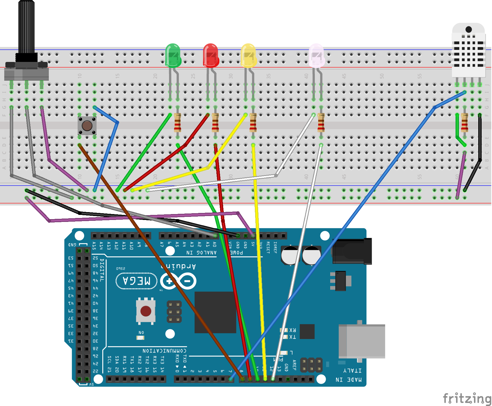

# Doxygen
- [Doxygen Side](https://hazavi.github.io/Arduino_Klima/)
- [Doxygen Kode documentation](https://hazavi.github.io/Arduino_Klima/html/klima3_8ino.html)

# Konstruktionens opbygning og komponenter

Dette klima anlæg projekt er en simpel termostatstyret løsning ved hjælp af en Arduino. Systemet måler temperaturen med en DHT11-sensor og viser status med fire LED'er. En potentiometer bruges til at justere måltemperaturen, mens en knap kan tænde og slukke termostaten. Måltemperaturen gemmes  i EEPROM, så den huskes, selv hvis strømmen slukkes.

## Komponenter

- **DHT11-sensor** – Måler temperaturen.
- **Potentiometer (POT_PIN)** – Bruges til at justere måltemperaturen mellem 15°C og 30°C.
- **Knap (BUTTON_PIN)** – Tænder eller slukker termostaten.
- **LED'er:**
  - **Rød** lyser, hvis temperaturen er for lav.
  - **Gul** lyser, hvis temperaturen er for høj.
  - **Grøn** lyser, når temperaturen er tæt på måltemperaturen.
  - **Hvid** lyser, når termostaten er slukket.
- **EEPROM** – Gemmer måltemperaturen, så den ikke nulstilles, når systemet slukkes.

## Forbindelser

Alle komponenter er forbundet til forskellige pins på Arduino’en.

## Programmets opbygning

Programmet er delt op i tre hoveddele:

1. **Biblioteker og globale variabler:**
   - DHT sensor bibliotek bruges til at styre DHT11-sensoren.
   - EEPROM bibliotek bruges til at gemme måltemperaturen.
   - Variabler bruges til at holde styr på termostatens status, måltemperatur, og en tolerance.

2. **Setup-funktion:**
   - Starter seriel kommunikation og sætter sensor og LED’er op.
   - Læser måltemperaturen fra EEPROM og sikrer, at den er inden for 15-30°C.

3. **Loop-funktion:**
   - **Tænd/sluk termostat**: Knappen bruges til at skifte termostaten til eller fra. Når den er fra, lyser den hvide LED.
   - **Juster temperatur**: Potentiometeret justerer måltemperaturen, som derefter gemmes i EEPROM.
   - **Læs temperatur og opdater LED’er**: Temperaturen måles, og LED-status opdateres baseret på, om temperaturen er for høj, lav, eller tæt på måltemperaturen.

## Brugervejledning

1. Tænd systemet ved at tænde for Arduinoen. Måltemperaturen bliver hentet fra EEPROM.
2. Juster temperaturen ved at dreje på potentiometeret. Den kan justeres fra 15°C til 30°C.
3. Skift termostatens status ved at trykke på knappen. Hvid LED lyser, når termostaten er slukket.

### LED-status:

- **Grøn**: Temperaturen er tæt på måltemperaturen.
- **Rød**: Temperaturen er for lav.
- **Gul**: Temperaturen er for høj.
- **Hvid**: Termostaten er slukket.

### Seriel Monitor

Seriel Monitor viser aktuelle målinger og status.

